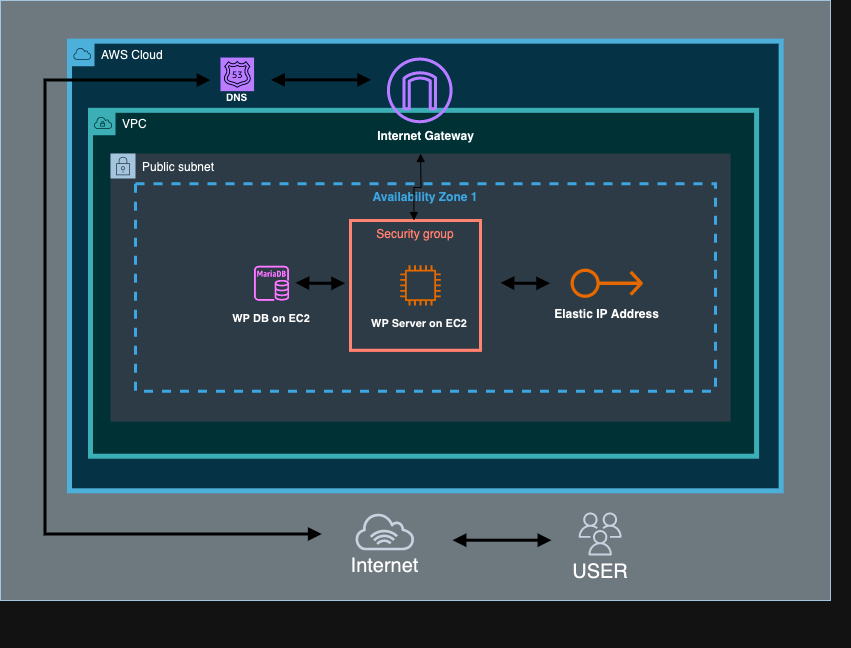
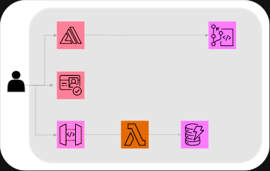

# Project Proposal: Hosting Made Easy - Optimised AWS Infrastructure with Minimal Effort
## Overview
This proposal outlines distinct projects, each focusing on key aspects of AWS deployment, security, and automation.

## Goals
1. **WordPress Deployment on AWS:**
   - Gain practical experience with EC2, Linux, MySQL databases, and security groups.
   - Establish proficiency in setting up web applications using AWS resources.
   

2. **Build a Full End-to-End Serverless Web Application on AWS:**
   - Build working web application leveraging serverless architecture on AWS.
   - Address real-world scenarios for secure and scalable application deployment.


3. **Infrastructure as Code (IaC) usinf CloudFormation and Terraform:**
   - Solidify IaC skills by recreating previous projects using Terraform.
   - Showcase expertise in infrastructure automation by replacing manual resource creation with Terraform scripts.

## Specifications
### Project 1 - WordPress Deployment on EC2
- **Duration:** 1 weeks
- **Key Skills:** EC2, Linux, MySQL, Security Groups
- **Deliverables:**
  - Successfully deployed WordPress server on an EC2 instance.
  - Documentation demonstrating proficiency in resource setup.

### Project 2 - End-to-End Web Serverless Application on AWS 
- **Duration:** 1 weeks
- **Prerequisite:** Completion of End-to-End Web Application using mutiple AWS Servcies 
### **Key Skills** 
#### Serverless Computing: 
- Using AWS Lambda functions for backend application logic
- Triggering Lambda functions with API Gateways and other AWS services
- Leveraging a serverless architecture for scalability and cost savings

#### Full Stack Development:
- Creating an interactive front-end website with HTML, CSS, and JavaScript
- Integrating front-end code with backend AWS services
- Learning how different components fit together in modern web apps

#### DevOps:
- Setting up a CI/CD pipeline with CodeCommit and Amplify
- Automating builds and deployments using AWS developer tools

#### Cloud & AWS:
- Getting hands-on experience using core AWS infrastructure services
- Understanding AWS serverless and database services like DynamoDB
- Learning best practices for architecting on AWS

#### Authentication & Security:
- Implementing user registration and sign-in flows with Amazon Cognito
- Securing API access with API Gateway authorizers

#### Data Storage:
- Storing and retrieving data in a NoSQL DynamoDB table database

#### Logging & Monitoring:
- Viewing CloudWatch Logs for Lambda function execution
- Debugging and optimizing performance of AWS applications

##**Deliverables:**
  - Deployed full end to end web application using mutiple AWS services.
  - Set up a DynomoDB database and established secure connections.
  - Documentation showcasing real-world application deployment scenarios.

### Project 3 - Infrastructure as Code (IaC) using CloudFormation & Terraform
- **Duration:** 1 weeks
- **Prerequisite:** Completion of WordPress Deployment
- **Key Skills:** Terraform, Automation, Resource Recreation
- **Deliverables:**
  - Recreated all previous projects using Terraform scripts.
  - Demonstration of infrastructure automation expertise.

## Milestones
1. **Week 1:** Completion of WordPress Deployment on EC2
   - Successful deployment of a WordPress server.
   - Documentation submission.

2. **Week 2:** Completion of Serverless Web Application Deployment
   - Deployment of WordPress in an advanced environment.
   - Documentation of the setup and security measures.

3. **Week 2:** Completion of Infrastructure as Code (IaC) CloudFormation & Terraform
   - Recreated all projects using Terraform.
   - Final presentation showcasing Terraform scripts and automation benefits.


# Press Release: WordPress Hosting Made Easy - Optimised AWS Infrastructure with Minimal Effort


## LAUNCH OF A TAILORED SOLUTION
A group of cloud engineers today launched a new managed WordPress hosting service specifically tailored for solopreneurs and small business owners on a budget. The innovative platform handles all WordPress hosting complexities so users can devote more time to building site content and less time managing servers and tehnical knowhows. 

## FEATURE-RICH SERVICE
The service features enterprise-level WordPress infrastructure running on Amazon Web Services (AWS), including automatic scaling, daily backups, easy restores, managed updates, CDN, and 24/7 expert support. Users benefit from optimised AWS configurations and proprietary technology that improves WordPress speed and security. 


## SIMPLIFYING WORDPRESS HOSTING
> "We are focused on driving the effort out of hosting WordPress for solopreneurs and small teams so they can focus on what matters - creating compelling sites," said Maz, principal architect. "By taking care of the WordPress infrastructure, security, and management, our customers can simply create more and develop better."

## ADDRESSING INDUSTRY CHALLENGES
The service was born out of the increasing difficulties freelancers and small business owners faced finding affordable, managed WordPress hosting solutions on the public cloud. Pain points included unpredictable costs, server management complexities, lack of scaling capabilities, and companies selling excessive features at expensive price points. 

## LIBERATING USERS
> "The freedom gained from offloading the hosting responsibilities is invaluable for our target customers," explained Simon. "We handle everything related to the WordPress servers and runtime so all they need to worry about is their content."

## GET STARTED TODAY
If you are in need of online resume/portfolo site, you can get started by visiting www.cloudesigner.co.uk and email your  information. The cloudesigner will take care of the rest.

## FAQ Section: 

**What WordPress versions do you support?**

We support the latest version of WordPress as well as the two previous major releases. When new versions come out, we have an expedited testing and certification process to ensure compatibility and stability.

**How are security and backups handled?**

Security is one of our top priorities. All data is encrypted in transit and at rest. We run daily automated vulnerability scans and have DDoS mitigation capabilities. Daily automated backups are performed with a 30-day retention policy. 

**What kind of scaling do you provide?** 

Our platform leverages AWS auto scaling groups to dynamically add or remove capacity based on site traffic. This allows us to instantly scale up to handle spikes from events like new product launches.

**What level of support is included?**

All our plans include 24/7 email and chat support from our team of WordPress experts. We also maintain robust status pages, incident reports, and maintenance schedules.

**How long does it take to launch a new site?**

Typically we can have a new site up and running in less than 60 minutes. Customers can launch right from their control panel and develop using WordPress like normal.

**What is your uptime SLA?**

We guarantee 99.95% uptime excluding scheduled maintenance. All incidents are meticulously monitored and customers are kept informed throughout any events.

**Do you offer any money-back guarantees?** 

Yes, we offer a 30-day money-back guarantee so customers can evaluate our platform risk-free. This gives them ample time to confirm it meets their WordPress hosting needs.


# Step-by-Step Guide: Deploy WordPress on AWS with Free Hosting & SSL Certificate

## Introduction
In this step-by-step guide, we will walk through the process of setting up a WordPress website on an Amazon Web Services (AWS) EC2 instance. The best part? AWS offers a free tier for the first 12 months, making this a cost-effective solution. Additionally, we’ll secure our site with a free auto-renewing SSL certificate using Let’s Encrypt and Certbot.

## Prerequisites
Before you begin, ensure you have the following:

- An AWS account (if not, sign up for 12 months FREE at AWS Free Tier).
- A registered domain name (e.g., purchased from a registrar like Google Domains etc).
- Basic knowledge of the command line.

## Step 1: Launch an EC2 Instance
1. Visit [AWS Free Tier](https://aws.amazon.com/free/) and log in to your AWS account.
2. Navigate to the EC2 dashboard and click “Launch Instance.”
3. Filter the eligible instances for the free tier and choose “Ubuntu Server 20.04 LTS.”
4. Select the t2.micro instance type and configure storage (you can increase to 30GB).
5. Add tags if needed and configure security groups to allow SSH, HTTP, and HTTPS traffic.
6. Launch the instance, create a new key pair, download it, and launch the instance.
7. Allocate Elastic IP Address, then Associate Elastic IP Address to your EC2 Instance for a static IP address.

## Step 2: Configure Domain and DNS
1. Copy the public IP of the EC2 instance.
2. In your domain registrar (e.g., Google Domains), add DNS records:
   - A record for your domain pointing to the EC2 instance IP.
   - A record for www.yourdomain.com pointing to the same IP.
3. Allow time for DNS propagation.

## Step 3: Connect to the EC2 Instance
1. Once the instance is running, copy the public IP address.
2. Open a terminal and use SSH to connect:
   ```bash
   chmod 400 your-key.pem
   ssh -i your-key.pem ubuntu@your-public-ip
   ```

## Step 4: Install LEMP Stack (Linux, Nginx, MySQL, PHP)
1. Update and upgrade the system:
   ```bash
   sudo apt update
   sudo apt upgrade
   ```
2. Install the LEMP stack:
   ```bash
   sudo apt install nginx mariadb-server php-fpm php-mysql
   ```

## Step 5: Install WordPress
1. Create a WordPress directory and download WordPress:
   ```bash
   cd /var/www
   sudo wget https://wordpress.org/latest.tar.gz
   sudo tar xzvf latest.tar.gz
   sudo rm latest.tar.gz
   ```
2. Set ownership and permissions:
   ```bash
   sudo chown -R www-data:www-data wordpress
   sudo find wordpress/ -type d -exec chmod 755 {} \;
   sudo find wordpress/ -type f -exec chmod 644 {} \;
   ```

## Step 6: Setup the Database
1. Secure your MariaDB installation by adding a password and disabling other features.
   ```bash
   sudo mysql_secure_installation
   ```
2. Access the MariaDB console with the password that you just created.
   ```bash
   sudo mysql -u root -p
   ```
3. Within the MariaDB console, create a database for WordPress.
   ```sql
   create database example_db default character set utf8 collate utf8_unicode_ci;
   create user 'example_user'@'localhost' identified by 'example_pw';
   grant all privileges on example_db.* TO 'example_user'@'localhost';
   flush privileges;
   exit
   ```

## Step 7: Configure Nginx Web Server
1. Navigate to the directory which contains configuration files for the Nginx web server, and create a new configuration file.
   ```bash
   sudo vim /etc/nginx/sites-available/wordpress.conf
   ```
2. Paste the configuration and save.
   ```nginx
   upstream php-handler {
       server unix:/var/run/php/php7.4-fpm.sock;
   }
   server {
       listen 80;
       server_name your_domain.com www.your_domain.com;
       root /var/www/wordpress;
       index index.php;
       location / {
           try_files $uri $uri/ /index.php?$args;
       }
       location ~ \.php$ {
           include snippets/fastcgi-php.conf;
           fastcgi_pass php-handler;
       }
   }
   ```
3. Enable the Nginx configuration and restart the server:
   ```bash
   sudo ln -s /etc/nginx/sites-available/wordpress.conf /etc/nginx/sites-enabled
   sudo nginx -t
   sudo systemctl restart nginx
   ```

## Step 8: Install SSL Certificate with Certbot
1. Install Certbot:
   ```bash
   sudo snap install core
   sudo snap refresh core
   sudo snap install --classic certbot
   sudo ln -s /snap/bin/certbot
