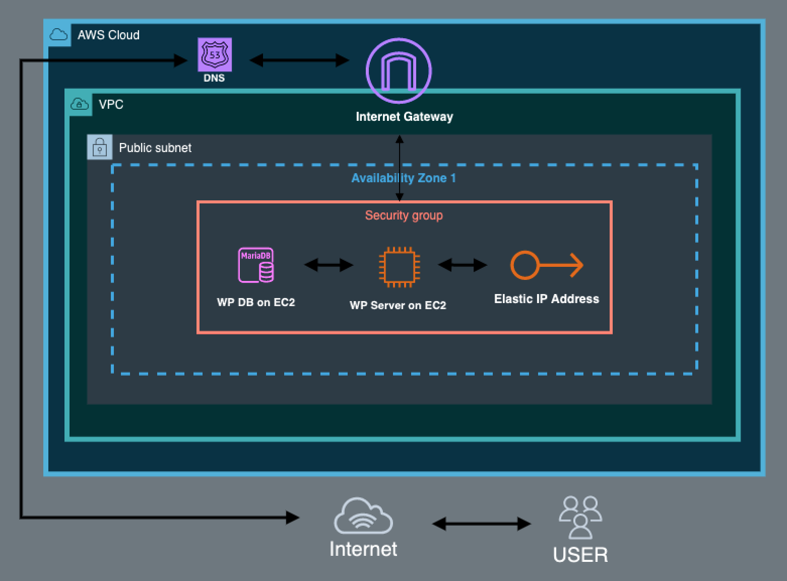
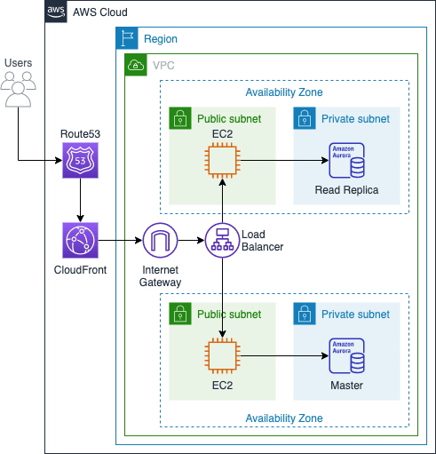

# Press Release: WordPress Hosting Made Easy - Optimised AWS Infrastructure with Minimal Effort

## LAUNCH OF A TAILORED SOLUTION
A group of cloud engineers today launched a new managed WordPress hosting service specifically tailored for solopreneurs and small business owners on a budget. The innovative platform handles all WordPress hosting complexities so users can devote more time to building site content and less time managing servers and tehnical knowhows. 

## FEATURE-RICH SERVICE
The service features enterprise-level WordPress infrastructure running on Amazon Web Services (AWS), including automatic scaling, daily backups, easy restores, managed updates, CDN, and 24/7 expert support. Users benefit from optimised AWS configurations and proprietary technology that improves WordPress speed and security. 

## SIMPLIFYING WORDPRESS HOSTING
> "We are focused on driving the effort out of hosting WordPress for solopreneurs and small teams so they can focus on what matters - creating compelling sites," said Maz, principal architect. "By taking care of the WordPress infrastructure, security, and management, our customers can simply create more and develop better."

## ADDRESSING INDUSTRY CHALLENGES
The service was born out of the increasing difficulties freelancers and small business owners faced finding affordable, managed WordPress hosting solutions on the public cloud. Pain points included unpredictable costs, server management complexities, lack of scaling capabilities, and companies selling excessive features at expensive price points. 

## LIBERATING USERS
> "The freedom gained from offloading the hosting responsibilities is invaluable for our target customers," explained Simon. "We handle everything related to the WordPress servers and runtime so all they need to worry about is their content."

## GET STARTED TODAY
If you are in need of online resume/portfolo site, you can get started by visiting www.cloudesigner.co.uk and email your  information. The cloudesigner will take care of the rest.

## FAQ Section: 

**What WordPress versions do you support?**

We support the latest version of WordPress as well as the two previous major releases. When new versions come out, we have an expedited testing and certification process to ensure compatibility and stability.

**How are security and backups handled?**

Security is one of our top priorities. All data is encrypted in transit and at rest. We run daily automated vulnerability scans and have DDoS mitigation capabilities. Daily automated backups are performed with a 30-day retention policy. 

**What kind of scaling do you provide?** 

Our platform leverages AWS auto scaling groups to dynamically add or remove capacity based on site traffic. This allows us to instantly scale up to handle spikes from events like new product launches.

**What level of support is included?**

All our plans include 24/7 email and chat support from our team of WordPress experts. We also maintain robust status pages, incident reports, and maintenance schedules.

**How long does it take to launch a new site?**

Typically we can have a new site up and running in less than 60 minutes. Customers can launch right from their control panel and develop using WordPress like normal.

**What is your uptime SLA?**

We guarantee 99.95% uptime excluding scheduled maintenance. All incidents are meticulously monitored and customers are kept informed throughout any events.

**Do you offer any money-back guarantees?** 

Yes, we offer a 30-day money-back guarantee so customers can evaluate our platform risk-free. This gives them ample time to confirm it meets their WordPress hosting needs.

Let me know if you need any other questions added or have additional details!
